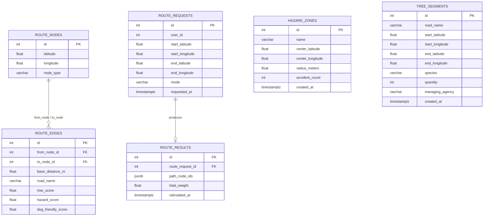
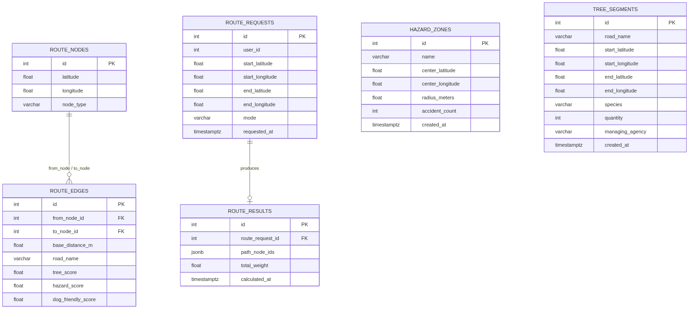

# Gildle ERD

`suvisdev/apps/gildle` ORM(`adapter/outbound/orm/`) 기준 **Gildle DB** 테이블 구조입니다.

가로수길 안전 경로 탐색 도메인: `route_nodes`/`route_edges`로 경로 그래프를 이루고, `route_requests`/`route_results`로 요청·결과를 1:1 기록합니다. `hazard_zones`(결빙 위험구역)와 `tree_segments`(가로수 구간)는 원천 데이터 테이블이며, DB FK 없이 별도 전처리 배치의 좌표 근접 매칭 결과가 `route_edges`의 환경 점수 컬럼에 반영됩니다.

> **2026-07 변경 (Schema Revision v2):**
> - `route_edges`에 `tree_score`/`hazard_score`/`dog_friendly_score` 추가 — **전처리 배치**가 `tree_segments`/`hazard_zones`와의 근접 매칭 결과를 채움 (라우팅 시 실시간 좌표 계산 금지, 계절 가중치는 유스케이스 계층에서 `requested_at` 기반 파생). 전처리 배치 스크립트 자체는 이번 개정 범위 밖
> - 시간 컬럼 4개(`route_requests.requested_at`, `route_results.calculated_at`, `hazard_zones.created_at`, `tree_segments.created_at`) `timestamp` → **`timestamptz`** 통일
> - `route_edges`에 `(from_node_id, to_node_id, road_name)` 복합 UNIQUE 추가 — 동일 두 노드를 잇는 도로가 복수 존재할 수 있어 `road_name` 포함 3중. `road_name` NULL인 엣지가 많으면 NULL끼리는 UNIQUE 충돌이 나지 않아 중복 방지 효과가 약해짐 (데이터 확인 후 2중 UNIQUE 전환 여부 재검토 필요)
> - `route_requests.user_id` 추가 (nullable, **물리 FK 없음**) — gildle은 `users` 테이블을 소유하지 않으므로 논리 참조만 (mova `UserId` VO 패턴과 동일), 익명 요청 허용
> - `route_results.path_node_ids` `json` → **`jsonb`** — 인덱싱·연산자 지원. 배열-테이블 정규화(`route_result_nodes`)는 하지 않음 (역방향 조회 필요해지면 그때 정규화)
> - `route_edges`는 **무향 그래프**로 취급 (저장 1행, 조회 시 양방향 탐색) — 방향성 정책 문서화, 스키마 변경 없음
> - `route_requests.mode`, `route_nodes.node_type` 허용값 문서화 (DB enum 강제 없음, 유스케이스 계층에서 검증)

## 전체 ERD

mermaid ER 파서는 동일 엔티티 쌍 사이에 관계선을 두 개 이상 그리면 파싱 오류가 나서, `ROUTE_NODES`↔`ROUTE_EDGES`의 `from_node_id`/`to_node_id` self-ref FK 두 개를 한 줄(`"from_node / to_node"`)로 합쳐 표기했습니다. 실제 컬럼은 아래 표·ORM을 참고하세요.

**단일 출처:** ERD 다이어그램은 **이 파일의 mermaid 코드 블록만** 수정합니다. 별도 `.mmd` 파일은 두지 않습니다.

## 관계

| 관계 | 카디널리티 | 설명 |
|------|------------|------|
| ROUTE_NODES → ROUTE_EDGES | 1:N (×2, self-ref) | `route_edges.from_node_id` / `to_node_id` 모두 `route_nodes.id` FK. 동일 테이블을 두 번 참조하므로 ORM에서 `foreign_keys=[...]`로 모호성 해소. 무향 그래프로 취급(저장 1행, 조회 시 양방향 탐색), v2에서 방향성 정책만 문서화(스키마 변경 없음) |
| ROUTE_REQUESTS → ROUTE_RESULTS | 1:1 | `route_results.route_request_id` UNIQUE FK — 요청 하나당 결과 하나 (`uq_route_results_route_request_id`) |

**다이어그램에 선 없음 (DB FK 아님):**

| 연결 | 설명 |
|------|------|
| ROUTE_REQUESTS → USERS | `user_id` (v2, nullable) — **물리 FK 없음**, 논리 참조만. gildle은 `users` 테이블을 소유하지 않음(mova `UserId` VO 패턴과 동일). 익명 요청 허용 |
| ROUTE_EDGES ← TREE_SEGMENTS / HAZARD_ZONES | **v2 목표 설계:** 별도 전처리 배치가 좌표 근접 매칭을 수행해 `route_edges.tree_score`/`hazard_score`/`dog_friendly_score`를 채움. 라우팅 시점에는 이 점수 컬럼만 읽고 실시간 좌표 계산은 하지 않음. 계절 가중치(봄/가을 감면, 겨울 위험 가중)는 스키마가 아닌 유스케이스 계층에서 `requested_at` 기반으로 파생 적용(`domain/services/route_weight_calculator.py`). 전처리 배치 스크립트는 이번 개정 범위 밖 — 점수 컬럼 도입 전까지는 v1 방식(실시간 좌표 근접 매칭)이 유지됨 |

## 제약·인덱스

| 테이블 | 제약 |
|--------|------|
| `route_edges` | `(from_node_id, to_node_id, road_name)` UNIQUE — `uq_edges_from_to_road` (v2). `road_name` NULL 비율 높으면 재검토 |
| `route_results` | `route_request_id` UNIQUE — `uq_route_results_route_request_id` |
| `route_requests` | `user_id` FK 없음(논리 참조, v2) |

## 필드 설명

### route_nodes (경로 그래프 노드)

| 필드 | 설명 |
|------|------|
| latitude / longitude | 노드 좌표 |
| node_type | 노드 종류. 허용값(v2 문서화): `intersection`(교차로) \| `poi`(관심지점) \| `park_gate`(공원 출입구). DB enum 강제 없음 |

### route_edges (경로 그래프 간선)

| 필드 | 설명 |
|------|------|
| from_node_id / to_node_id | `route_nodes.id` self-ref FK — 간선의 시작·끝 노드. `(from_node_id, to_node_id, road_name)` 복합 UNIQUE(v2, `uq_edges_from_to_road`) |
| base_distance_m | 기본 거리(m), 가중치 계산의 base |
| road_name | 도로명 (nullable) — 가로수 구간 매칭 키. NULL 비율 높으면 위 UNIQUE 방지 효과 약해짐(재검토 대상) |
| tree_score | 가로수 밀도 점수 0~1 정규화 (v2, `server_default=0`) — 전처리 배치가 채움 |
| hazard_score | 결빙 위험 점수 0~1 정규화 (v2, `server_default=0`) — 전처리 배치가 채움 |
| dog_friendly_score | 반려견 적합도 점수 0~1 정규화 (v2, `server_default=0`) — 전처리 배치가 채움 |

### route_requests (경로 요청)

| 필드 | 설명 |
|------|------|
| user_id | 로그인 사용자 id (v2, nullable, **물리 FK 없음** — 논리 참조). 익명 요청은 NULL |
| start_latitude / start_longitude | 출발 좌표 |
| end_latitude / end_longitude | 도착 좌표 |
| mode | 이동 모드. 허용값(v2 문서화): `walk` \| `run`. DB enum 강제 없음 |
| requested_at | 요청 시각 (v2: `timestamptz`) |

### route_results (경로 계산 결과)

| 필드 | 설명 |
|------|------|
| route_request_id | `route_requests.id` UNIQUE FK — 요청 1건당 결과 1건 |
| path_node_ids | 계산된 경로의 노드 id 배열 (v2: `jsonb`) |
| total_weight | 경로 전체 가중치 합 |
| calculated_at | 계산 시각 (v2: `timestamptz`) |

### hazard_zones (결빙 위험구역, 원천 데이터)

| 필드 | 설명 |
|------|------|
| name | 구역명 |
| center_latitude / center_longitude | 중심 좌표 |
| radius_meters | 반경(m) |
| accident_count | 사고 건수 |
| created_at | 등록 시각 (v2: `timestamptz`) |

v2에서 `route_edges.hazard_score` 전처리 배치의 입력 원천으로 쓰임 — 테이블 자체는 삭제하지 않고 유지.

### tree_segments (가로수 구간, 원천 데이터)

| 필드 | 설명 |
|------|------|
| road_name | 도로명 (nullable) |
| start_latitude / start_longitude | 구간 시작 좌표 |
| end_latitude / end_longitude | 구간 끝 좌표 |
| species | 수종 (벚나무, 느티나무 등) |
| quantity | 식재 수량 |
| managing_agency | 관리 기관 |
| created_at | 등록 시각 (v2: `timestamptz`) |

v2에서 `route_edges.tree_score`/`dog_friendly_score` 전처리 배치의 입력 원천으로 쓰임 — 테이블 자체는 삭제하지 않고 유지.

## ORM 매핑

| 테이블 | 모델 | 경로 |
|--------|------|------|
| `route_nodes` | `RouteNodeOrm` | `gildle/adapter/outbound/orm/route_node_orm.py` |
| `route_edges` | `RouteEdgeOrm` | `gildle/adapter/outbound/orm/route_edge_orm.py` |
| `route_requests` | `RouteRequestOrm` | `gildle/adapter/outbound/orm/route_request_orm.py` |
| `route_results` | `RouteResultOrm` | `gildle/adapter/outbound/orm/route_result_orm.py` |
| `hazard_zones` | `HazardZoneOrm` | `gildle/adapter/outbound/orm/hazard_zone_orm.py` |
| `tree_segments` | `TreeSegmentOrm` | `gildle/adapter/outbound/orm/tree_segment_orm.py` |

공통 PK 규칙은 `suvisdev/_docs/entity-rules.md`를 따릅니다 (`id` int 자동 증감).
